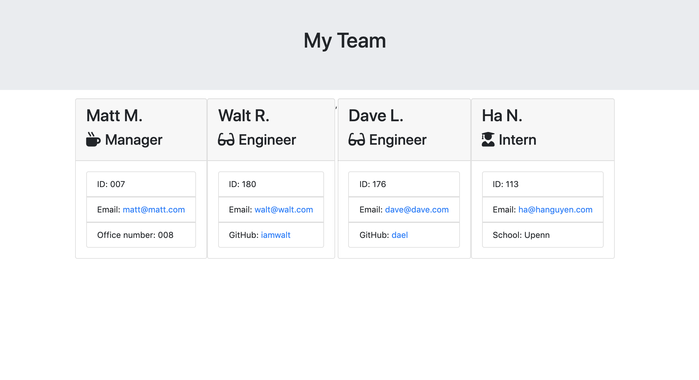

## About employee-tracker

This is an application that tracks and manages all the members in a software engineering team. When the user has completed building the team, the application will create an HTML file that displays a nicely formatted team roster based on the information provided by the user.

## Demonstration:

## Description:

This application was developed with Node.js and invoked with `node index.js` command line. The application will prompt the user for information about the team manager and then information about the team members. The user can input any number of team members, and they may be a mix of engineers and interns. 

## Installation: 
Run `npm install`.

## Instructions

Run all testing units. They need to pass. Then use the `Inquirer npm package` to prompt the user for their email, id, and specific information based on their role with the company. For instance, an intern may provide their school, whereas an engineer may provide their GitHub username. The project must prompt the user to build an engineering team. 

## Link to employee-tracker

https://github.com/iamha1/employee-tracker

